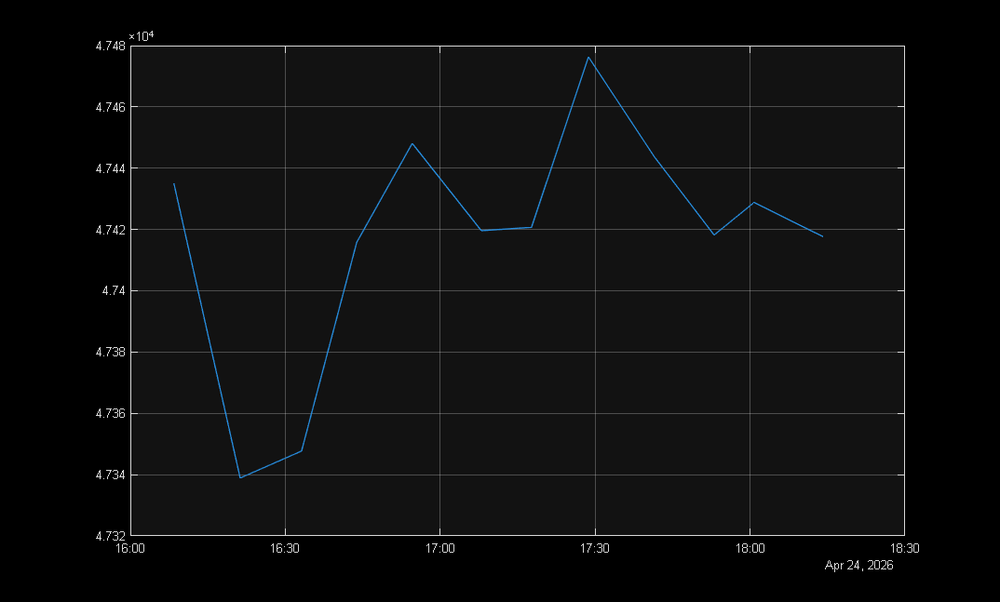
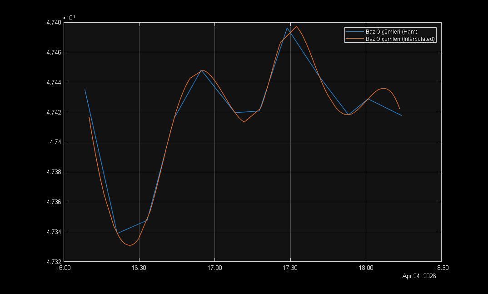
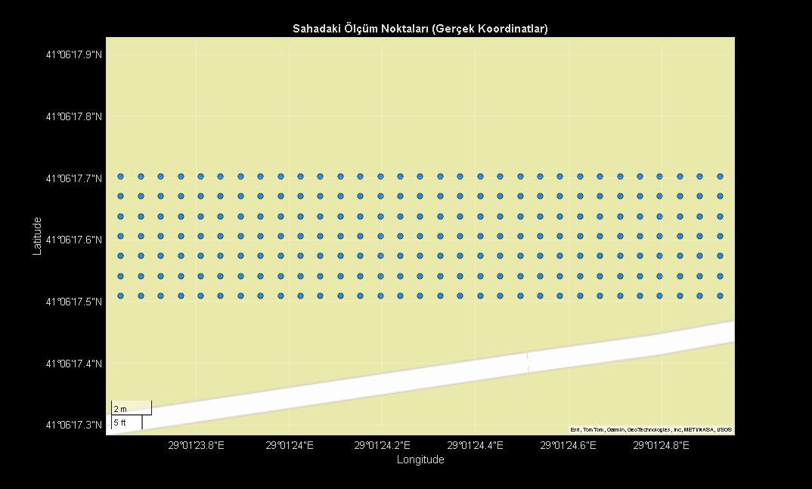
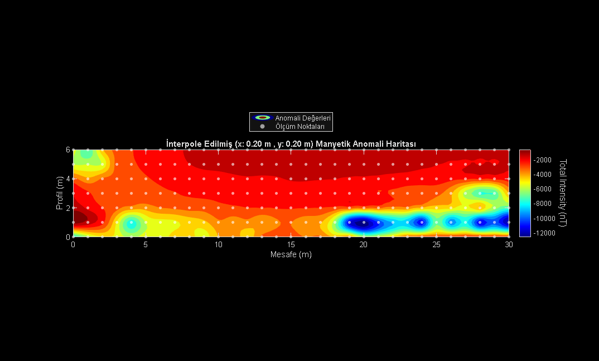

::: content

## Contents

<div>

- [Parametreler](#1)
- [Günlük Değişim (Diurnal) Düzeltmesi](#2)
- [IGRF Düzeltmesi](#3)
- [Harita Üzerinde Ölçüm Noktalarının Görselleştirilmesi](#4)
- [1. Veriyi Matris Formuna Dönüştürme (Reshape)](#5)
- [2. Yeni Grid ve İnterpolasyon](#6)
- [Contour Map - Görselleştirme](#7)

</div>

## Parametreler

```codeinput
numProfiles = 7;
numMeters = 31; % 0'dan 30'a kadar 31 nokta
profileRange = 1; % Profiller arası mesafe (metre).

coordinats = [
    41.1048635, 29.0235903; % Orijinal
    41.1048635, 29.0232328; % 30m Batı
    41.1049175, 29.0235903; % 6m Kuzey - 7 profil = 6 metre
    41.1049175, 29.0232328 % 30m Batı + 6m Kuzey
    ];


filename = './manyetik_data.xlsx';
data = readtable(filename);

stations = string(data{:, 1});
deltaX = data{:, 2};
timeStr = string(data{:, 3});
measures = data{:, 4};

% MATLAB'ın saat hesaplaması yapabilmesi için noktaları iki noktaya çeviriyoruz
timeStr = strrep(timeStr, '.', ':');
times = datetime(timeStr, 'InputFormat', 'HH:mm:ss');

% Baz ve Profil indexlerini ayırma
idxBase = contains(stations, 'Baz', 'IgnoreCase', true);
idxProfile = contains(stations, 'Profil', 'IgnoreCase', true);

basetimes = times(idxBase);
baseMeasures = measures(idxBase);

figure(1)
plot(basetimes, baseMeasures);
grid on;
hold on;

profiletimes = times(idxProfile);
profileMeasures = measures(idxProfile);
profileNames= stations(idxProfile);
profiledeltaX = deltaX(idxProfile); % Ölçüm alınan metre 0-30

% 7. Profilin 6. Değeri NaN (Boş)
% Önceki ve sonraki değerlerin ortalaması ile değiştiriyorum
% 6 * 31 adet veri noktası sonra 7. profile ulaşırız
% Ölçüm noktaları 0'dan başladığı için 6. metre -> 7 oluyor
meanWindow = 2;
profileMeasures(6*numMeters +7) = mean( ...
    profileMeasures(6*numMeters +7 -meanWindow: ...
    6*numMeters +7 +meanWindow), ...
    'omitnan');
```



## Günlük Değişim (Diurnal) Düzeltmesi

```codeinput
% Profil ölçümlerinin yapıldığı saatlerdeki teorik Baz değerlerini
% interpolasyon yardımıyla hesaplıyoruz
interpolatedBase = interp1(basetimes, baseMeasures, profiletimes, 'spline');
plot(profiletimes, interpolatedBase)
legend("Baz Ölçümleri (Ham)", "Baz Ölçümleri (Interpolated)")

% Delta T_diurnal = T_obs - (T_base - T_mean)
% omitnan -> omit nan (NaN değerlerini çıkartarak ortalama hesaplar)
tMean = mean(baseMeasures, 'omitnan');
tDiurnal = profileMeasures - interpolatedBase + tMean;
```




## IGRF Düzeltmesi

```codeinput
jsonFile = fileread('./igrfwmmData.json');
IGRF_F = jsondecode(jsonFile).result.totalintensity;    % Toplam manyetik alan (nT)

magneticAnomaly = tDiurnal - IGRF_F;
```

## Harita Üzerinde Ölçüm Noktalarının Görselleştirilmesi

```codeinput
lats_vec = linspace(coordinats(1, 1), coordinats(3, 1), numProfiles);
lons_vec = linspace(coordinats(1, 2), coordinats(2, 2), numMeters);

[LON, LAT] = meshgrid(lons_vec, lats_vec);

figure(2);
% 'satellite', 'streets', 'topographic'
geoscatter(LAT(:), LON(:), 30, 'filled', 'MarkerEdgeColor', 'k');
geobasemap streets;
title('Sahadaki Ölçüm Noktaları (Gerçek Koordinatlar)');
```



## 1. Veriyi Matris Formuna Dönüştürme (Reshape)

magneticAnomaly (217x1) -\> z (7x31)

```codeinput
z = reshape(magneticAnomaly, numMeters, numProfiles)';

% x: Profil boyu (0'dan 30. metreye)
% y: Profiller arası mesafe (0, 1, 2, 3, 4, 5, 6. metreler)
x = 0:(numMeters-1);                                % 0, 1, 2, ..., 30
y = 0:profileRange:(numProfiles-1)*profileRange;    % 0, 1, 2, ..., 6

% Ölçüm noktalarını haritada göstermek için hazırlıyoruz
[x_meas, y_meas] = meshgrid(x, y);
```

## 2. Yeni Grid ve İnterpolasyon

X ve Y\'yi daha düşük ölçüm aralıkları ile veri alınmış gibi
hazırlıyoruz

```codeinput
dx = 0.2;
dy = 0.2;

x_int = 0:dx:(numMeters-1);
y_int = 0:dy:(numProfiles-1)*profileRange;
[X, Y] = meshgrid(x_int, y_int);

% Manyetik Anomali verilerini Interpolasyon ile yeni kordinat düzlemine
% uygun hale getiriyoruz

Z = griddata(x, y, z, X, Y, 'v4');
%Z = interp2(x, y, z, X, Y, 'linear');
```

## Contour Map - Görselleştirme

```codeinput
figure;
[C, h] = contourf(X, Y, Z, 15); % 15 -> Renk paletindeki renk sayısı

set(h, 'LineColor', 'none');

colormap(jet);
cb = colorbar;
ylabel(cb,'Total Intensity (nT)','FontSize',12,'Rotation',270)
shading interp;

title(sprintf("İnterpole Edilmiş (x: %.2f m , y: %.2f m) Manyetik Anomali Haritası", dx, dy));
xlabel('Mesafe (m)');
ylabel('Profil (m)');
axis equal;

% Gerçek ölçüm noktalarının haritaya yerleştirilmesi
hold on;

scatter(x_meas, y_meas, 15, 'w', 'filled', 'MarkerFaceAlpha', 0.6);
legend('Anomali Değerleri', 'Ölçüm Noktaları', Location='northoutside');
```



[Published with MATLAB®
R2025b](https://www.mathworks.com/products/matlab/)
:::
